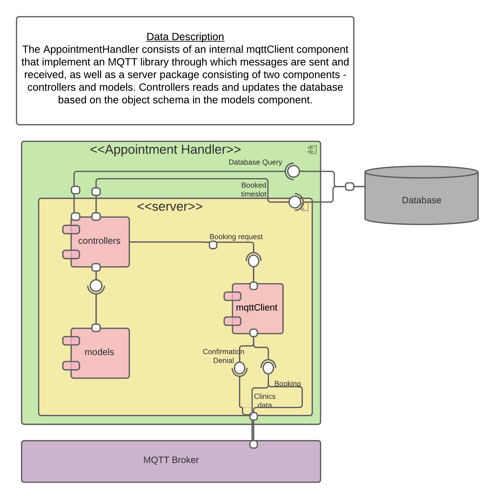

# AppointmentHandler

The AppointmentHandler is the component whose responsibility it is to handle dentist appointment bookings within the system. The AppointmentHandler subscribes to booking requests that get published by the UI component which are checked against the database in order to determine if a booking request is valid or not. It does this by querying the database for the requested timeslot at the dentistry chosen by the user, and judging if the timeslot can be booked or not by the number of dentists available for appointments at the dentistry in question. It publishes a booking confirmation or rejection based on the result given by this algorithm.


## Server Structure

| File        | Purpose           |
| ------------- | ------------- |
| [README.md](./README.md) | Everything about the component |
| [mqttclient](./mqttClient) | MQTT client |
| [server](./server) | server source code |
| app.js | main class that runs the component |
| server/controllers | controller classes |
| server/controllers/appointments.js | appointments controller |
| server/models | model classes |
| server/models/appointment.js | appointment model |
| package.json | component meta-information |
| package-lock.json | component meta-information |

# Component diagram

 


## Requirements

To run the AppointmentHandler the client needs to have the following software installed on their machine.

- Node.js v14.17.6 or later
- mqtt.js v4.2.8 or later

## Project setup
Installs all project dependencies specified in [package.json](./package.json).

1- Map to the server directory by entering this in the terminal 
```
cd server 
```
2- Install the dependencies
```
npm install
```

### Compiles and runs component
3- Run server.
```
npm run dev
```
